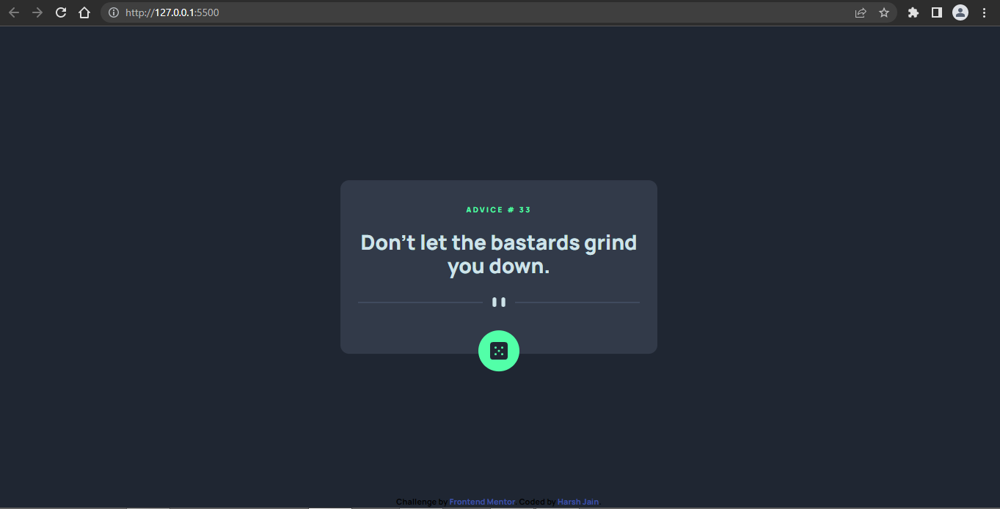

# Frontend Mentor - Advice generator app solution

This is a solution to the [Advice generator app challenge on Frontend Mentor](https://www.frontendmentor.io/challenges/advice-generator-app-QdUG-13db). Frontend Mentor challenges help you improve your coding skills by building realistic projects.

## Table of contents

- [Overview](#overview)
  - [The challenge](#the-challenge)
  - [Screenshot](#screenshot)
- [My process](#my-process)
  - [Built with](#built-with)
  - [What I learned](#what-i-learned)
  - [Continued development](#continued-development)
  - [Useful resources](#useful-resources)
- [Author](#author)
- [Acknowledgments](#acknowledgments)

## Overview

### The challenge

Users should be able to:

- View the optimal layout for the app depending on their device's screen size
- See hover states for all interactive elements on the page
- Generate a new piece of advice by clicking the dice icon

### Screenshot



## My process

### Built with

- Semantic HTML5 markup
- Mobile-first workflow
- [Tailwind CSS](https://tailwindcss.com/docs/installation) - CSS Framework

### What I learned

The prime goal of doing this project was to get my hands dirty with fetch API. It is a nice starter project to get started with APIs. I also decided to built this project using Tailwind CSS so as to recap some tailwind CSS as well.

Fetching data from an API using javascript's Fetch API:

```js
fetch(URL)
  .then(response => response.json())
  .then(data => console.log(data));
```

### Continued development

With this project I got my self started with fetch API. I am looking forward to do some projects regarding APIs so as to get a strong grip on the API concepts.

### Useful resources

I would highly recommend [mdn web docs](https://developer.mozilla.org/en-US/), if someone is looking forward to start learning web development or get their concepts clearer and stronger. It has everything, one would want to learn, the most trustworthy resource out there!

If one finds it difficult to read the docs, they can watch video tutorials on youtube and then can read about the same on mdn.

- [Using the Fetch API](https://developer.mozilla.org/en-US/docs/Web/API/Fetch_API/Using_Fetch) - This really helped me in understanding how to fetch the data using Fetch API.

- [Tailwind CSS](https://tailwindcss.com/docs/installation/play-cdn) - You can get started with tailwind css by using the play-cdn. Just follow the steps mentioned, and you can start using the tailwind css then. Having trouble with any property ? there is a search button, where we can search for a particular CSS property, read through it and customize it as well. They really have a very nice documentation!

## Author
- Frontend Mentor - [Harsh Jain](https://www.frontendmentor.io/profile/harshj11)

## Acknowledgments
A huge shout out to [mdn web docs](https://developer.mozilla.org/en-US/) for putting such an amazing content in a well documented manner.

A big thank you to [Frontend Mentor](https://www.frontendmentor.io/) for curating these beautiful challenges to make people learn by doing.

Until next time, Happy Coding!